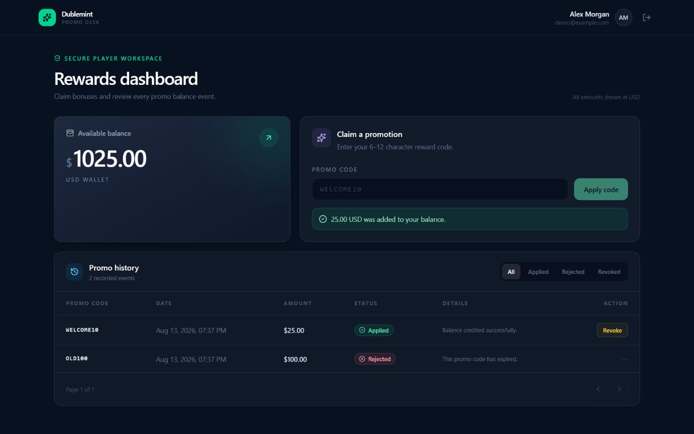
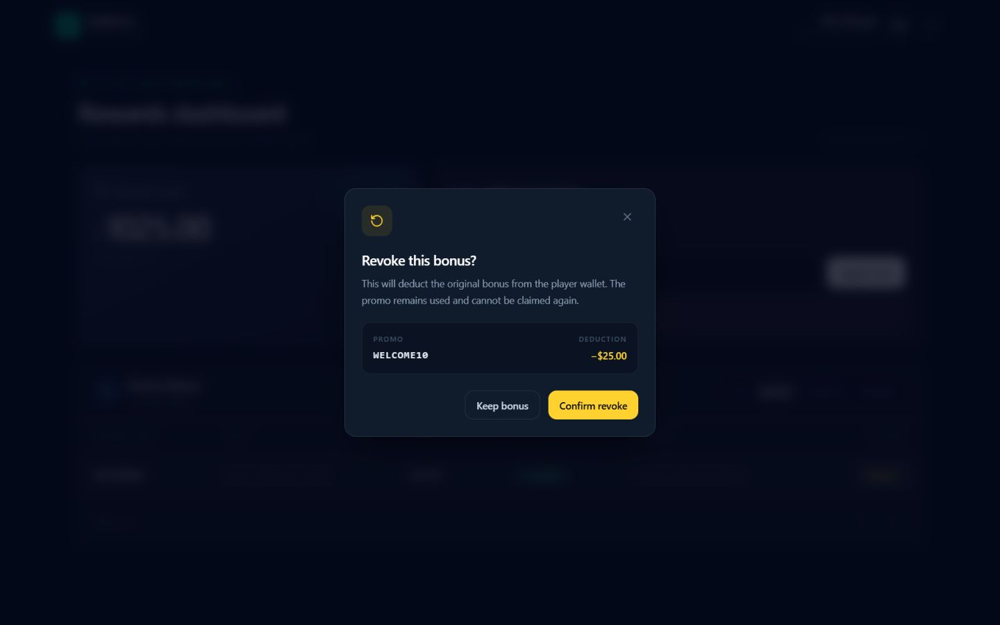

# Dublemint Promo Desk

A Docker-first Laravel/Vue technical assignment for a betting-platform wallet domain. It implements authenticated promo claiming, auditable filtered history and concurrency-safe bonus revocation, with financial correctness treated as a core requirement rather than a UI afterthought.



## What is included

- Sanctum Bearer-token demo authentication
- `POST /api/promo/claim` with validation and distinct business errors
- `GET /api/promo/history` with status filters and pagination
- `PATCH /api/promo/{claimId}/revoke` with ownership and one-time debit protection
- Applied, rejected and revoked audit history
- Exact integer money storage, transactions, row locks and PostgreSQL constraints
- Responsive Vue UI with loading, success, error, empty, filtering and confirmation states
- 42 PostgreSQL-backed feature tests (145 assertions)

## Stack

| Layer | Installed version / image |
| --- | --- |
| PHP | 8.4.24 |
| Laravel | 13.25.0 |
| Laravel Sanctum | 4.3.3 |
| PostgreSQL | 17.10 (`postgres:17-alpine`) |
| Nginx | `nginx:1.29-alpine` |
| Node.js / npm | 22.23.2 / 10.9.8 |
| Vue | 3.5.41 |
| Vite | 8.2.1 |
| Tailwind CSS | 4.3.3 |
| axios | 1.19.0 |

## Architecture

The backend follows a small, explicit Laravel flow:

```text
Route -> Sanctum / Form Request -> Controller -> Promo Action -> Eloquent / PostgreSQL
                                              -> API Resource -> JSON
```

Controllers handle HTTP concerns. `ClaimPromoAction` and `RevokePromoAction` own transactional wallet behavior. Form Requests validate transport input, API Resources keep response shapes consistent, and `PromoDomainException` maps known business conflicts to stable public responses.

The Vue application uses Composition API components under `resources/js/components/promo`, page-level composition under `resources/js/pages`, and isolated axios clients under `resources/js/services`.

Docker Compose runs four services:

- `app` — PHP 8.4 FPM and Composer dependencies
- `nginx` — public application/API gateway on port 8090
- `postgres` — persistent PostgreSQL 17 database with health check
- `node` — Vite development server on port 5173

## Prerequisites

Only these host tools are required:

- Git
- Docker Desktop (or Docker Engine)
- Docker Compose v2

PHP, Composer, Node.js and PostgreSQL do not need to be installed on the host.

## Quick start

```bash
git clone https://github.com/oleksandrhoianggwp/testTaskDublemint.git
cd testTaskDublemint
cp .env.example .env
docker compose up -d --build
docker compose exec app php artisan key:generate
docker compose exec app php artisan migrate:fresh --seed
```

PowerShell equivalent for the environment file:

```powershell
Copy-Item .env.example .env
```

Dependencies are installed into the Docker images and initialized into named volumes on first startup. After changing dependency manifests in an existing checkout, update those volumes with `docker compose exec app composer install` and `docker compose exec node npm ci`, then rebuild when the Dockerfiles also changed.

### URLs

- Application: <http://localhost:8090>
- REST API base: <http://localhost:8090/api>
- Vite assets/HMR: `http://localhost:5173`
- Laravel health check: <http://localhost:8090/up>

### Demo account

```text
Email:    demo@example.com
Password: password
Balance:  1000.00 USD
```

### Seeded promo codes

| Code | Amount | State |
| --- | ---: | --- |
| `WELCOME10` | 25.00 USD | Valid |
| `BONUS50` | 50.00 USD | Valid |
| `OLD100` | 100.00 USD | Expired |
| `PAUSED25` | 25.00 USD | Inactive |

Run `docker compose exec app php artisan migrate:fresh --seed` before a clean demonstration; it resets database data and makes both valid codes claimable again.

## Everyday Docker commands

```bash
docker compose ps
docker compose logs -f app
docker compose logs -f nginx
docker compose logs -f node
docker compose logs -f postgres
docker compose down
```

To delete containers **and all persisted database/dependency volumes**:

```bash
docker compose down -v
```

Do not use `-v` if the local database data must be retained.

## Verification commands

```bash
# Recreate and seed the application database
docker compose exec app php artisan migrate:fresh --seed

# Backend suite (uses the separate PostgreSQL dublemint_testing database)
docker compose exec app php artisan test

# PHP style check
docker compose exec app vendor/bin/pint --test

# Frontend lint and production build
docker compose exec node npm run lint
docker compose exec node npm run build
```

Latest verified result: **42 tests passed, 145 assertions**; Pint, ESLint and the Vite production build passed.

## API contract

| Method | Endpoint | Auth | Purpose |
| --- | --- | --- | --- |
| `POST` | `/api/login` | Public, throttled | Create demo Sanctum token |
| `GET` | `/api/me` | Bearer | Current player and balance |
| `POST` | `/api/logout` | Bearer | Revoke current token |
| `POST` | `/api/promo/claim` | Bearer, throttled | Claim a server-configured promo |
| `GET` | `/api/promo/history` | Bearer | Own history; `status`, `page`, `per_page` |
| `PATCH` | `/api/promo/{claimId}/revoke` | Bearer, throttled | Revoke own applied claim once |

Supported history statuses are `applied`, `rejected` and `revoked`; `per_page` is limited to 1–50. Promo validation failures return `422`. Business responses use clear codes such as `PROMO_EXPIRED`, `PROMO_ALREADY_USED`, `CLAIM_ALREADY_REVOKED` and `INSUFFICIENT_BALANCE_TO_REVOKE`.

### Example requests

Login and copy the returned token:

```bash
curl -X POST http://localhost:8090/api/login \
  -H "Accept: application/json" \
  -H "Content-Type: application/json" \
  -d '{"email":"demo@example.com","password":"password"}'

export TOKEN="paste-the-returned-token"
```

Claim, list history and revoke a returned claim ID:

```bash
curl -X POST http://localhost:8090/api/promo/claim \
  -H "Accept: application/json" \
  -H "Authorization: Bearer $TOKEN" \
  -H "Content-Type: application/json" \
  -d '{"code":"WELCOME10"}'

curl "http://localhost:8090/api/promo/history?status=applied&per_page=10" \
  -H "Accept: application/json" \
  -H "Authorization: Bearer $TOKEN"

curl -X PATCH http://localhost:8090/api/promo/1/revoke \
  -H "Accept: application/json" \
  -H "Authorization: Bearer $TOKEN"
```

## Financial and security decisions

### Exact money

Balances and bonus amounts are stored as `BIGINT` minor units: `2500` represents `25.00`. No persisted wallet operation uses floats. PostgreSQL checks require non-negative user balances and positive promo/claim amounts.

### Authentication and ownership

All promo routes use `auth:sanctum`. The player always comes from the token; claim/revoke payloads accept neither `user_id`/`player_id` nor a monetary amount. Revoke queries are additionally scoped to that authenticated player's claim, preventing IDOR.

For this local technical demonstration, the Vue client stores its Bearer token in `localStorage` and removes it on logout or `401`. A production first-party browser deployment should normally prefer an HttpOnly secure cookie/session design after a complete XSS/CSRF threat review.

### Duplicate claim and concurrency safety

Claim locks the player and promo rows, validates eligibility, creates the claim and credits the balance in one PostgreSQL transaction. A partial unique index on `(user_id, promo_code_id)` for `applied` and `revoked` rows is the second line of defense against concurrent duplicate consumption. Rejected attempts do not consume the code.

### Revoke behavior

Revoke locks the player first and claim second, matching the wallet lock order. Only `applied` claims may be revoked, and the exact original bonus is deducted in the same transaction as the status/timestamp change. A second call returns a conflict rather than debiting twice. If the current wallet is smaller than the original bonus, revoke returns `409` and changes neither balance nor claim; it never creates a negative balance or silently clamps to zero.

### Audit history

Validly formatted business attempts are retained as `applied`, `rejected` or `revoked` records. Malformed HTTP payloads return validation errors and are not recorded as business claims. History is newest-first, paginated and always scoped to the authenticated player.

## Important project structure

```text
app/
  Actions/Promo/          # Atomic claim and revoke use cases
  Enums/                  # Claim states
  Exceptions/             # Stable domain errors
  Http/Requests/          # Input validation
  Http/Resources/         # API serialization
  Support/Money.php       # Exact boundary formatting
database/
  migrations/             # Constraints and partial unique index
  seeders/                # Demo player and promos
docker/                   # PHP, Nginx, Node and DB initialization
resources/js/
  components/promo/       # Claim, balance, history and modal UI
  pages/                  # Login and dashboard composition
  services/               # axios authentication/promo clients
tests/Feature/            # 42 PostgreSQL-backed feature tests
docs/screenshots/         # Running-app walkthrough
```

## Submission artifacts

- [Part 2 code review](CODE_REVIEW.md)
- [AI-assisted development log](AI_PROMPT_LOG.md)
- [Running UI screenshots](docs/screenshots/) — nine full-width landscape demonstration states

Published task branches preserve reviewable milestones:

```text
chore/bootstrap
feat/ticket-1-api
feat/ticket-2-api
feat/ticket-1-ui
feat/ticket-2-ui
chore/final-polish-docs
```

## 2–5 minute demonstration flow

1. Reset with `docker compose exec app php artisan migrate:fresh --seed` and open <http://localhost:8090>.
2. Sign in as `demo@example.com` / `password`; point out the 1000.00 USD balance.
3. Enter `bad!` to show client format validation.
4. Claim `OLD100`; show the specific expired error and rejected history record.
5. Claim `WELCOME10`; show +25.00, balance 1025.00 and the applied row.
6. Submit `WELCOME10` again; show `PROMO_ALREADY_USED` behavior and unchanged balance.
7. Switch between Applied/Rejected filters and return to All.
8. Click **Revoke** on the applied row; show the confirmation containing `WELCOME10` and `-25.00`.
9. Confirm; show balance back at 1000.00, status `Revoked` and the missing Revoke action.
10. Optionally call the same revoke endpoint again to demonstrate the `CLAIM_ALREADY_REVOKED` conflict without a second debit.


